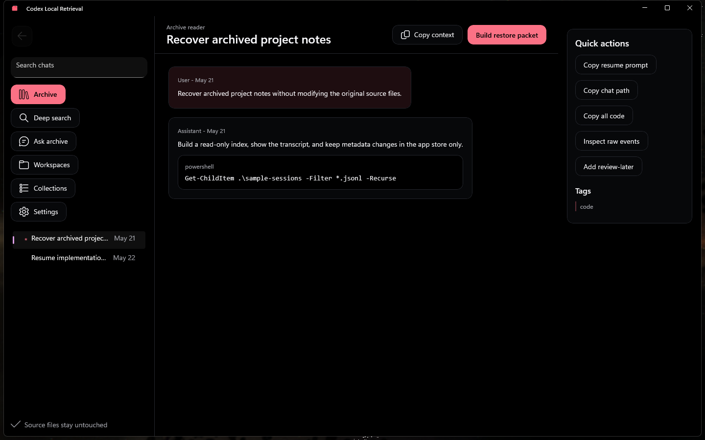

# Codex Local Retrieval

Codex Local Retrieval is an unofficial Windows desktop app for browsing local Codex session archives without modifying the source files. It is built with WinUI 3, auto-detects local Codex chat folders, and keeps user metadata in a separate local app store. The repository includes sanitized demo data for tests and screenshots.

This project is not affiliated with OpenAI. It is intended for developers who keep local Codex session files and want a safer way to search, review, copy code, and build restore packets from older conversations.

## Status

First public release candidate. The native app builds, the service tests pass on Windows with the .NET 8 SDK, and the release ships as a portable Windows x64 ZIP. The app is local-first and read-only toward source session files. MSIX signing and fresh public screenshots are still future release work.



## Features

| feature | status | proof | demo/docs |
|---|---|---|---|
| Read local archive index | works and verified | `dotnet test` | `docs/tutorials/getting-started.md` |
| Browse chat transcripts | works and verified | WinUI build + sample screenshot | `docs/assets/hero-screenshot.png` |
| Filter sidebar chats | works and verified | native app manual check | README quickstart |
| Deep fuzzy/content search | works and verified | `DeepSearch_ReturnsContentSnippetsAndPathPayload` | `docs/how-to/common-tasks.md` |
| Workspace and collection groups | works and verified | native build | `docs/reference/project-reference.md` |
| Copy restore packet, code, or chat path | works and verified | `CopyPayload_BuildsRestorePacketAndCodePayload` | `docs/how-to/common-tasks.md` |
| Theme/accent/shape settings | works and verified | native build | `docs/reference/project-reference.md` |
| Optional OpenAI-compatible AI providers | works and verified | native build + DeepSeek live check | `docs/how-to/common-tasks.md` |
| Auto-detect or set chat source path | works and verified | `IndexRootAsync_StoresConfiguredChatRootAndSkipsIndexes` | `docs/how-to/common-tasks.md` |
| Portable Windows x64 ZIP | works and verified | package script + launcher smoke test | release notes |
| Signing guidance | documented | signing guide | `docs/how-to/signing.md` |

## Download

The first release is a portable Windows x64 ZIP:

```text
codex-local-retrieval-win-x64.zip
```

Extract the ZIP and run:

```text
Codex Local Retrieval.exe
```

The ZIP opens to a top-level launcher and an `app` folder. Keep the `app` folder next to `Codex Local Retrieval.exe`. The ZIP is self-contained for Windows x64. It is not code signed, so Windows may show a SmartScreen warning.

On startup, the app tries to index local chats from common Codex folders such as `%USERPROFILE%\.codex\sessions`. To set a different folder, open `Settings`, use `Chat source`, and choose `Index folder`.

## Signing

The current ZIP is unsigned. A warning-free Windows release needs a trusted code-signing certificate or Microsoft Trusted Signing. A self-signed development certificate can be used for local testing, but it will not remove SmartScreen warnings for public users.

## Quickstart

Prerequisites:

- Windows 10 or Windows 11
- .NET 8 SDK

Build the native app:

```powershell
dotnet build .\native\CodexLocalRetrieval.Native\CodexLocalRetrieval.Native.csproj -p:Platform=x64
```

Run it from the build output:

```powershell
.\native\CodexLocalRetrieval.Native\bin\x64\Debug\net8.0-windows10.0.26100.0\win-x64\CodexLocalRetrieval.Native.exe
```

Run tests:

```powershell
dotnet test .\native\CodexLocalRetrieval.Native.Tests\CodexLocalRetrieval.Native.Tests.csproj -p:Platform=x64
```

The checked-in `data/app-store.json` is sanitized sample data. User metadata is written to:

```text
%LocalAppData%\CodexLocalRetrieval\app-store.json
```

Package a portable Windows x64 ZIP:

```powershell
.\tools\release\package-win-x64.ps1
```

The package script builds the app into `artifacts/codex-local-retrieval-package/app`, builds the top-level `Codex Local Retrieval.exe` launcher, and creates `artifacts/codex-local-retrieval-win-x64.zip`.

No environment variables are required for normal use. Optional AI provider keys are entered in the app under Settings and stored through Windows credentials, not in `data/app-store.json`.

## Documentation

- Tutorial: `docs/tutorials/getting-started.md`
- How-to: `docs/how-to/common-tasks.md`
- Signing: `docs/how-to/signing.md`
- Reference: `docs/reference/project-reference.md`
- Explanation: `docs/explanation/project-overview.md`

## Limitations

- The app is designed for local files and does not sync data across machines.
- Auto-detection is aimed at standard Codex folders. If your chats live elsewhere, set the folder manually in Settings.
- AI features are optional and use OpenAI-compatible chat completions. Ask Archive sends only retrieved excerpts by default, not the full archive.
- Public screenshots must use sanitized demo data. Do not publish screenshots that show private local paths, usernames, session titles, or conversation text.
- The release ZIP is not signed. MSIX packaging/signing is not complete.

## Safety

The app should not rewrite live Codex session files, `state_5.sqlite`, or `session_index.jsonl`. It reads source files and stores app-specific metadata separately. If you test with real archives, review copied paths and screenshots before sharing them.

## License

MIT. See `LICENSE`.
